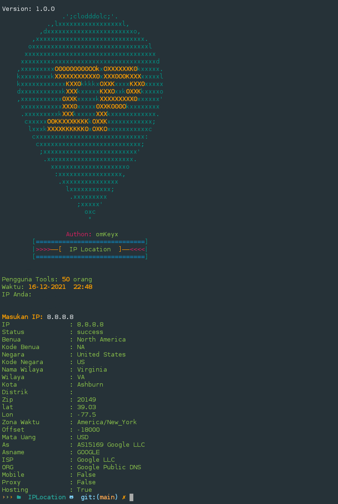

<p align="center">
      
</p>

Code by: omKeyx
# IPLocation
Tools IPLocation bisa melihat informasi ip addres

Version: 1.0.0
# Cara pakai
Update package
```
$ pkg update && pkg upgrade 
```

Install modul
```
$ pkg install git

$ pkg install python

$ pip install requests
```

Install tools
```
$ git clone https://github.com/omKeyx/IPLocation

$ cd IPLocation

$ python IPLocation.py
```

output
<p align="center">
    

# Version
Version: 1.0.0 Waktu: 17-12-2021
